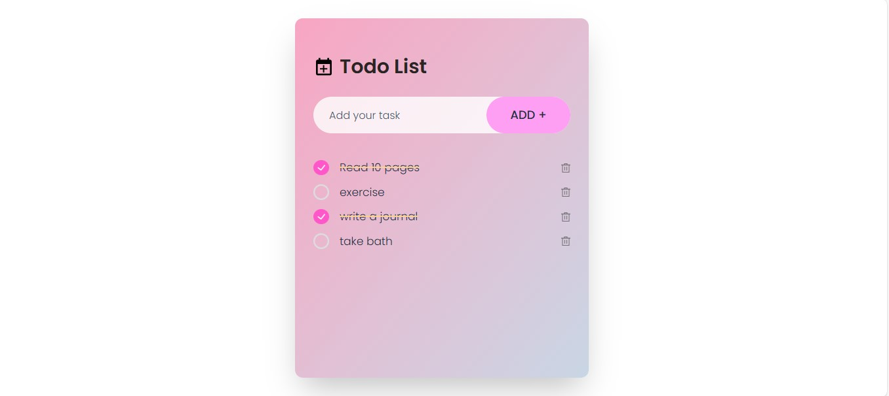

# To-Do List App

A simple and interactive To-Do List application built using React.js. This app allows users to manage their tasks with features like adding, completing, and deleting tasks. It also supports dark mode and uses `localStorage` to persist tasks across sessions.

## Features
- **Add Tasks**: Easily add new tasks to the list.
- **Mark Tasks as Complete**: Toggle the completion status of each task.
- **Delete Tasks**: Remove tasks from the list when completed or no longer needed.
- **Persistent Storage**: Tasks are stored using `localStorage`, ensuring they remain even after a page refresh.
- **Dark Mode**: A modern, dark theme to provide a comfortable user experience.
- **Responsive Layout**: Optimized for both desktop and mobile devices.

## Tech Stack
- **Frontend**: React.js
- **Styling**: Tailwind CSS (for responsive design)
- **Storage**: LocalStorage (for task persistence)

## Installation

1. Clone this repository:

   ```bash
   git clone https://github.com/yourusername/todo-app.git
   ```

2. Navigate to the project folder:

   ```bash
   cd todo-app
   ```

3. Install dependencies:

   ```bash
   npm install
   ```

4. Start the development server:

   ```bash
   npm start
   ```

The app will be running on `http://localhost:3000` by default.

## Usage

1. Add a new task by typing in the input field and clicking the **Add +** button.
2. Mark a task as completed by clicking the checkbox next to it.
3. Delete a task by clicking the delete icon next to it.
4. Your tasks will be saved even after refreshing the page, thanks to `localStorage`.

## Screenshots



